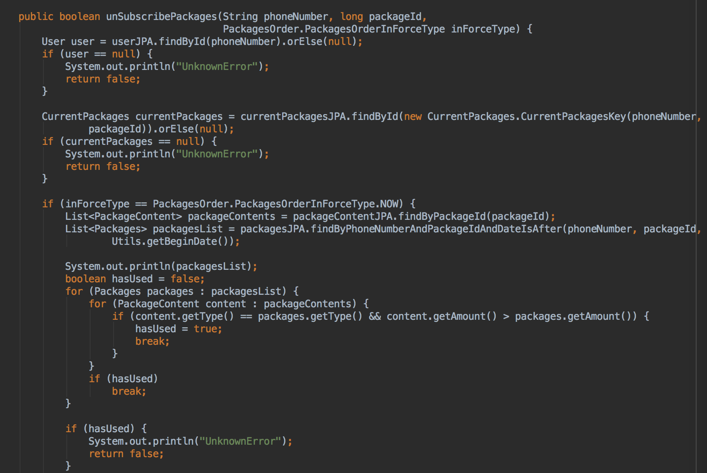
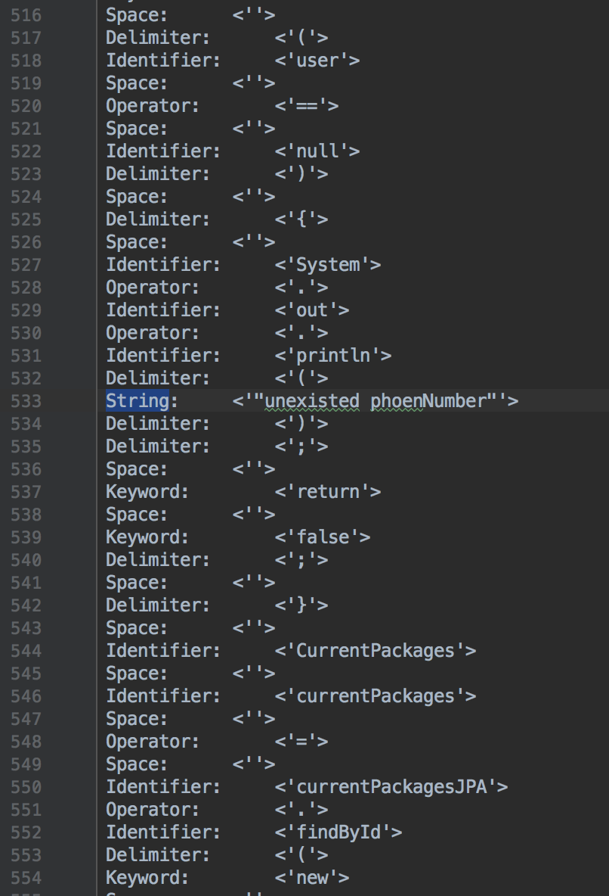

# 词法分析器

**作者：訾源**

**学号：161250220**

**邮箱：ziyuan@smail.nju.edu.cn**

[TOC]

## 目标

本次实验的目标是生成一个通用词法分析程序，类似Lex。

## 简要介绍

本次实验实现了一个纯英文环境下的简易版的Lex，MyLex，可以接受类似于Lex的一份语言说明，然后为该语言生成词法分析器，之后可以用生成的词法分析器去读取源程序进行解析。

## 实现思路

### MyLex语言说明

由于各个语言的词素的构成并不相同，因此需要用户来描述语言的构成要素。需要用户提供一个文本文件，作为MyLex的输入。

具体的格式如下：

```
basic_re_name1 re_defination1
...
basic_re_namek re_definationk
%%
re_name1 re_defination1
...
re_namek re_definationk
```

`basic_re_name`是用来定义的基础正则串，由于构成后面的正则串。如果后面的正则串需要用到前面的正则串，只需要在定义中使用`{basic_re_name}`即可。

`%%`后面是目标语言的词法单元的正则定义，当识别出一个词素后，会产生出一个键值对，key是正则串的名字，值是对应的代码段。

`%%`后的各个正则串识别的优先级从低到高递增。

所支持的正则符号有：

- `[-]`，表示某个区间；
- *
- +：一个或多个
- .：通配符
- ?：0个或1个

额外的，对于多个符号构成的小单元，需要用括号括起来。

样例如下：

```
digit [0-9]
letter [A-Za-z]
no_quotation ([ -!#-~]|(\\"))
no_new_line ([ -~]|\r)
%%
Space (\r|\n| |\t)+
Char '.'
String ("{no_quotation}*")
Delimiter ;|\{|\}|\(|\)|\[|\]|,|@
Operator \+|-|\*|/|%|~|!|(\+\+)|(--)|(<<)|(>>)|(>>>)|(<)|(>)|(<=)|(>=)|(==)|(!=)|(&)|(^)|\||(&&)|(\|\|)|\?|:|=|(\+=)|(-=)|(\*=)|(/=)|(%=)|(&=)|(^=)|(\\|=)|(<<=)|(>>=)|(>>>=)|\.
Identifier ({letter}|_)({letter}|{digit}|_)*
Comment (//{no_new_line}*\n)
Number {digit}+(\.{digit}*)?(L|d|f)?
Hex 0x[0-9A-Fa-f]+
Keyword (abstract)|(continue)|(for)|(new)|(switch)|(assert)|(default)|(goto)|(package)|(synchronized)|(boolean)|(do)|(if)|(private)|(this)|(break)|(double)|(implements)|(protected)|(throw)|(byte)|(else)|(import)|(public)|(throws)|(case)|(enum)|(instanceof)|(return)|(transient)|(catch)|(extends)|(int)|(short)|(try)|(char)|(final)|(interface)|(static)|(void)|(class)|(finally)|(long)|(strictfp)|(volatile)|(const)|(float)|(native)|(super)|(while)|(true)|(false)
```

这是一份`Java`语言的正则串描述，表达了`Java`中除了多行注释、JavaDoc之外的一切语法单元。

### RE ==> NFA

首先把RE串解析成RE节点，同时把`[-],.,+`等表达式解析成基本的正则表达式的元素。之后再通过一个栈来解决节点处理顺序的问题，同时使用汤普森算法来将RE节点转化成小的NFA并合并。

之后再将识别不同词法单元的NFA合并成最终的NFA。

用到的几个数据结构：

```java
public class NFA {

    private NFAState startState;

    private Map<NFAState, String> endStates;

    public NFA(NFAState startState) {
        this.startState = startState;
        this.endStates = new HashMap<>();
    }

    public NFA(NFAState startState, Map<NFAState, String> endStates) {
        this.startState = startState;
        this.endStates = endStates;
    }
}

public class NFAEdge {
    // may be null in nfa
    private Character tag;

    private NFAState fromState;

    private NFAState toState;

    public NFAEdge(Character tag, NFAState fromState, NFAState toState) {
        this.tag = tag;
        this.fromState = fromState;
        this.toState = toState;
    }
}

public class NFAState {

    private int id;

    private List<NFAEdge> outEdges;

    public NFAState() {
        id = NFAStateIDGenerator.getId();
        outEdges = new ArrayList<>();
    }
}
```

### NFA==>DFA

使用子集构造法（辅以epilson闭包），很容易就可以得到将NFA转化成DFA，感觉实际上还是有向图的一些遍历问题，没有太多好讲的。

用到了一些数据结构：

```java
public class DFA {

    static Map<Integer, DFAState> states = new HashMap<>();

    private DFAState startState;

    private Map<DFAState, String> endStates;

    public DFA(DFAState startState, Map<DFAState, String> endStates) {
        this.startState = startState;
        this.endStates = endStates;
    }
}

class DFAEdge {

    private char tag;

    private DFAState fromState;

    private DFAState endState;

    public DFAEdge(char tag, DFAState fromState, DFAState endState) {
        this.tag = tag;
        this.fromState = fromState;
        this.endState = endState;
    }
}

class DFAState {

    private int id;

    private Map<Character, DFAEdge> outEdges;

    private Set<NFAState> nfaStates;

    public DFAState(Set<NFAState> nfaStates) {
        id = DFAStateIDGenerator.getId();
        outEdges = new HashMap<>();
        this.nfaStates = nfaStates;
        DFA.states.put(id, this);
    }
}
```

和NFA的那些数据结构的一个很大的区别就是没有空边，以及每个节点的出边的符号各不相同。

### DFA生成词法分析器

DFA生成词法分析器的本质实际上是把由之前步骤生成的DFA硬编码的源代码中。为此我们需要一个模板：

```java
import java.io.BufferedReader;
import java.io.FileReader;
import java.util.*;

/**
 * Created on 2018/10/30.
 * Description:
 *
 * @author iznauy
 */
public class Template {

    public static class Token {

        public String type;

        public String code;

        public Token(String type, String code) {
            this.type = type;
            this.code = code;
        }

        @Override
        public String toString() {
            return type + ":\t\t<'" + code.trim() + "'>";
        }
    }

    private static Map<Integer, String> stateIdToTarget = new HashMap<>();

    private static Map<Integer, Map<Character, Integer>> dfa = new HashMap<>();

    private static int beginState = <BeginState>; // 0 will be replaced

    public static void main(String[] args) {
        if (args.length == 0) {
            System.out.println("Usage: java Template InputFile");
            return;
        }
        <init>
        // read source code
        StringBuilder sourceCodeBuilder = new StringBuilder();
        try (BufferedReader reader = new BufferedReader(new FileReader(args[0]))) {
            String line;
            while((line = reader.readLine()) != null)
                sourceCodeBuilder.append(line);
        } catch (Exception e) {
            e.printStackTrace();
            return;
        }
        char[] sourceCode = sourceCodeBuilder.toString().toCharArray();

        List<Token> tokens = new ArrayList<>();
        int pointer = 0;
        Set<Integer> endStates = stateIdToTarget.keySet();

        StringBuffer beforeEndState = new StringBuffer();
        StringBuffer afterEndState = new StringBuffer();

        int currentState = beginState;
        boolean toEnd = false;
        String endType = null;

        if (endStates.contains(currentState)) {
            toEnd = true;
            endType = stateIdToTarget.get(currentState);
        }

        while (true) {
            if (pointer >= sourceCode.length) {
                if (!toEnd && beforeEndState.length() == 0)
                    break;
                else if (!toEnd && beforeEndState.length() > 0) {
                    throw new RuntimeException("UnFinished Program");
                } else {
                    Token token = new Token(endType, beforeEndState.toString());
                    tokens.add(token);
                    beforeEndState.delete(0, beforeEndState.length());
                    if (afterEndState.length() == 0)
                        break;
                    else {
                        toEnd = false;
                        pointer -= afterEndState.length();
                        afterEndState.delete(0, afterEndState.length());
                        currentState = beginState;
                        continue;
                    }
                }
            }

            char currentChar = sourceCode[pointer];
            pointer++;

            Integer nextState = dfa.get(currentState).get(currentChar);
            if (nextState == null) {
                if (!toEnd)
                    throw new RuntimeException("Error");
                else {
                    toEnd = false;
                    Token token = new Token(endType, beforeEndState.toString());
                    tokens.add(token);
                    pointer -= afterEndState.length();
                    pointer--;
                    beforeEndState.delete(0, beforeEndState.length());
                    afterEndState.delete(0, afterEndState.length());
                    currentState = beginState;
                }
            } else {
                currentState = nextState;
                if (toEnd)
                    afterEndState.append(currentChar);
                else
                    beforeEndState.append(currentChar);

                if (endStates.contains(currentState)) {
                    toEnd = true;
                    endType = stateIdToTarget.get(currentState);
                    beforeEndState.append(afterEndState.toString());
                    afterEndState.delete(0, afterEndState.length());
                }
            }
        }

        for (Token token: tokens) {
            System.out.println(token);
        }

    }

    private static void addDFA(int state, int ... params) {
        Map<Character, Integer> nextStates = new HashMap<>();
        for (int i = 0; i < params.length / 2; i++) {
            char ch = (char) params[i * 2];
            int next = params[2 * i + 1];
            nextStates.put(ch, next);
        }
        dfa.put(state, nextStates);
    }

    private static void addEndState(String name, int ... states) {
        for (int state: states) {
            stateIdToTarget.put(state, name);
        }
    }

    <initEndState>

    <initGraph>
}
```

将当前的DFA的有关信息换一种表示形式，插入到该模板中即可。图仍然是用邻接表表示，只不过在模板中没有引入面向对象的成分，而是直接用邻接表表示。

用DFA去解析字符串有点像在图上根据当前字符进行遍历，本身代码并不算复杂。

有一点值得注意的是，在生成词法分析器时候，因为节点本身数量很多，可能超出了`Java`允许的单个方法的最大长度（65535字节），因此需要把方法拆成若干小方法才可以编译。

## 假设

假设源程序全部由英文字符构成，而且源程序没有任何词法错误。

## 运行实例

使用上述定义的`Java`词法描述，可以生成`Java`的词法分析器。可以实现对非常复杂的`Java`程序的解析。以我的某次数据库作业作为待解析的代码，数据库作业片段如下：



可以看出是非常复杂的，包含了字符串以及绝大部分的`Java`语言成分。

解析结果：



可以看出语法成分被详尽、准确的解析了出来。

- 我在example目录下已经生成了解析`Java`程序的语法分析器，助教可以自行尝试，同时，还准备了我的某次数据库作业的很复杂的一个类，`Example.java`，助教可以在example目录下，使用` java Template [sourceCode.java]`查看词法分析结果
- 助教也可以自己提供MyLex描述文件，来生成想要的语言的分析器。用法是`java Main [MyLex.czj] [destination_path]`，会在指定的路径生成`Template.java`文件，可以用来分析目标语言。

## 问题报告

- 在debug时候遇到了不少的问题，主要就是在不同的形式下进行转化，比如RE to NFA，NFA to DFA，稍不留神就会写bug，而且bug非常难调试。
  - 慢慢断点单步最后还是调出来了
- Java每个方法字节码最长65535字节，在自动生成代码时候很容易出现方法过长的情况。解决方案是把方法分成多个小方法。

## 感想

写编译器真的很难debug。尤其是在面对复杂正则串时候，NFA会生成非常多的状态，出了bug非常难调试。

以及编译器设计真的非常有意思。